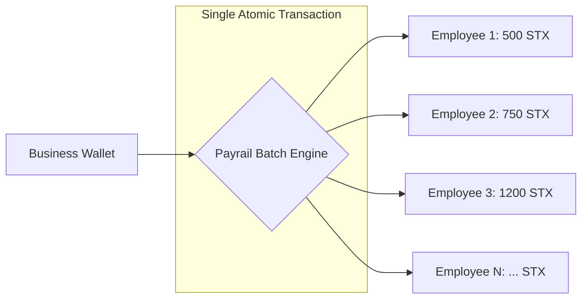

# 🚀 Payrail: The Decentralized Payroll Engine

> **Non-custodial, high-performance payroll infrastructure for global teams, powered by Bitcoin & Stacks.**

Payrail is a next-generation decentralized finance (DeFi) application designed to solve the friction of global workforce payments. By leveraging the **Stacks Blockchain**, Payrail enables businesses to execute payroll in **BTC and STX** directly from their own wallets—eliminating the need for custodial intermediaries, reducing overhead, and ensuring absolute financial sovereignty.

---

## 📽️ Preview & Demo

Payrail combines a premium Fintech aesthetic with the security of Bitcoin.

- **Premium Web-App**: Built with Next.js 15, Framer Motion, and Tailwind CSS 4.
- **On-Chain Settlements**: Atomic settlements via Clarity smart contracts.
- **Decentralized Identity**: Sign-in with your Bitcoin identity (BNS/Hiro/Leather).

---

## 🎯 The Problem: Why Payrail?

Traditional global payroll is broken for decentralized teams:

1.  **Custodial Risk**: Middlemen hold your funds, introducing counterparty risk.
2.  **High Fees**: International bank transfers can cost up to 5% in fees and exchange spreads.
3.  **Slow Settlements**: Cross-border payments take days to settle.
4.  **Lack of Transparency**: Businesses have no way to prove payments were made without bulky banking receipts.

**Payrail fixes this by bringing the payroll ledger directly onto the Bitcoin Layer 2.**

---

## 💡 Innovation: The Atomic Batching Engine

The core innovation of Payrail is its **Batch Payment Protocol**, implemented in the `payrail.clar` smart contract.

While standard wallet transfers require a separate transaction for every employee (high gas, manual effort), Payrail allows a business to bundle up to **20 payments** into a single atomic operation.

### How it Works:

- **Atomic Execution**: Either _all_ employees get paid, or _none_ do. This prevents partial failures where some staff are unpaid.
- **Gas Efficiency**: By batching, we reduce the per-transaction overhead, making it 10x more efficient for large teams.
- **Post-Condition Security**: Payrail utilizes Stacks' unique **Post-Conditions** to ensure that the contract _cannot_ withdraw a single micro-STX more than what was authorized for the specific batch.



---

## 🏗️ Tech Stack & Architecture

### Frontend Layer

- **Next.js 15**: Leveraging Server Components and Server Actions for high-performance data fetching.
- **TypeScript**: Full end-to-end type safety for blockchain interactions.
- **Tailwind CSS v4**: A cutting-edge, utility-first design system with custom HSL color tokens.
- **Framer Motion**: Smooth, high-fidelity micro-animations for a premium dashboard feel.
- **Lucide React**: Clean, semantic iconography.

### Blockchain Layer (Stacks L2)

- **Clarity Smart Contracts**: Predictable, non-Turing complete smart contracts for high-security financial logic.
- **`@stacks/connect`**: Seamless integration with Hiro, Leather, and Xverse wallets.
- **Post-Conditions**: Built-in protection against smart contract exploits.

### Backend & Data Ops

- **Supabase**: Real-time PostgreSQL database for team metadata and historical analytics.
- **Resend/Mailjet**: Automated onboarding and payment notification engine.
- **CoinGecko API**: Real-time BTC/STX price feeds for fiat-equivalent reporting.

---

## �️ Installation & Setup

### Prerequisites

- [Node.js](https://nodejs.org/) (v20 or higher)
- [Leather Wallet](https://leather.io/) installed in your browser.

### Environment Configuration

Create a `.env.local` in the root directory:

```env
# Supabase Configuration
NEXT_PUBLIC_SUPABASE_URL=xxxx
NEXT_PUBLIC_SUPABASE_ANON_KEY=xxxx

# Stacks Blockchain Configuration
NEXT_PUBLIC_CONTRACT_ADDRESS=ST1PQHQKV...
NEXT_PUBLIC_CONTRACT_NAME=payrail
```

### Installation Steps

1.  **Clone the Repository**
    ```bash
    git clone https://github.com/Wutche/payrail.git
    cd payrail
    ```
2.  **Install Dependencies**
    ```bash
    npm install
    ```
3.  **Launch the Development Server**
    ```bash
    npm run dev
    ```

---

## 🏆 Why Payrail Wins: Real-World Impact

Payrail isn't just a dApp; it's a **financial rail** for the future of work.

- **For Founders**: Reduce time spent on manual bank transfers from 4 hours to 4 minutes.
- **For Freelancers**: Get paid in hard money (BTC) instantly, anywhere in the world.
- **For Regulators**: Immutable, on-chain proof of payment for every single salary disbursement.

---

## � License

This project is licensed under the **MIT License**. See the `LICENSE` file for details.

---
