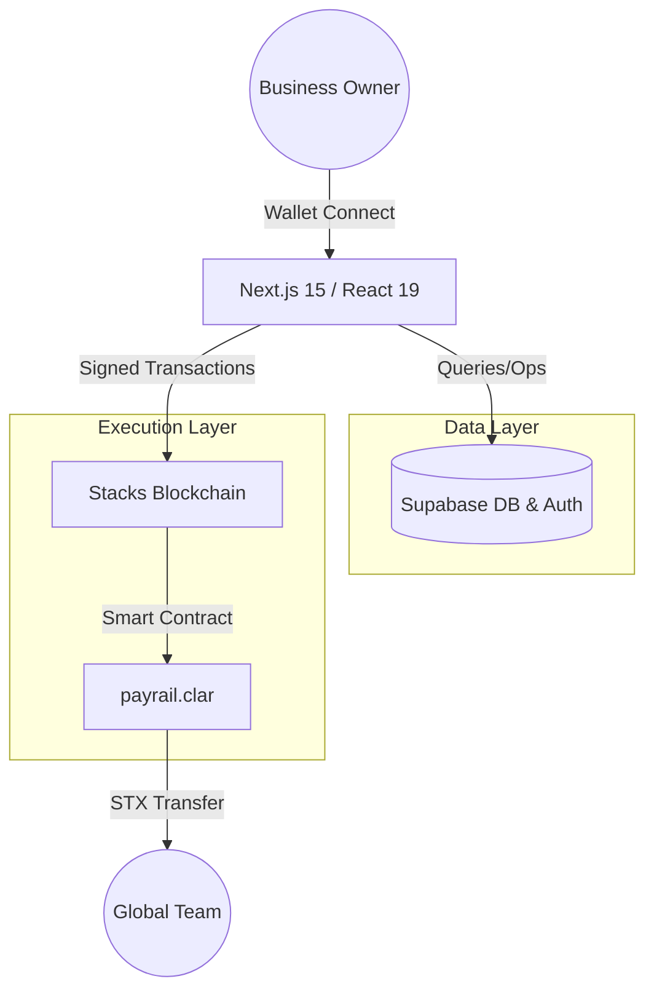
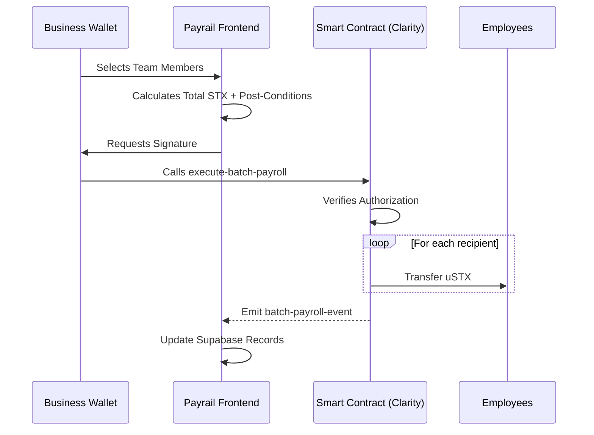

# Payrail 🚀

### Non-Custodial Bitcoin & STX Payroll Infrastructure

Payrail is a decentralized, high-performance payroll management platform built on the **Stacks Blockchain**. It enables businesses to manage global teams and process payments in **Bitcoin (BTC)** and **STX** without ever giving up custody of their funds.

---

## 🏗 Architecture Overview

Payrail uses a hybrid architectural model to combine blockchain-grade security with a modern, high-speed user experience.



---

## ✨ Key Features

- **Non-Custodial Payments**: All transactions are executed directly from the user's wallet (Leather, Hiro, Xverse).
- **Batch Payroll processing**: Pay up to **20 team members** in a single atomic transaction to save on time and gas fees.
- **Organization Management**: Create and manage organizational hierarchies and team metadata.
- **Real-time Tracking**: Monitor on-chain transaction statuses and payroll history.
- **Fiat Value Estimates**: Automated real-time conversion rates (BTC/STX to USD) for accurate reporting.

---

## ⚙️ How it Works

### 1. Business Registration

Before making payments, a wallet address must register as a "Business" on-chain. This creates an entry in the `payrail.clar` data map.

### 2. Batch Execution Flow

The batch payroll feature is the core of the efficiency engine. It uses an atomic `fold` operation in Clarity to ensure that either **all** payments succeed or **none** do.



---

## 🛠 Tech Stack

| Layer            | Technology                                       |
| :--------------- | :----------------------------------------------- |
| **Frontend**     | Next.js 15 (App Router), React 19, Framer Motion |
| **Styling**      | Tailwind CSS 4, Radix UI                         |
| **Blockchain**   | Stacks (L2 for Bitcoin), Clarity Smart Contracts |
| **Database**     | Supabase (PostgreSQL)                            |
| **Identity**     | Stacks Auth (Decentralized Identity)             |
| **Integrations** | Resend (Notifications), CoinGecko API (Prices)   |

---

## 📄 Smart Contract Logic (`payrail.clar`)

The heart of the application is a Clarity smart contract that manages:

- **`register-business`**: Authorizes a wallet to manage organizations.
- **`create-organization`**: Initializes a workspace on-chain.
- **`execute-payroll`**: Handles single STX transfers with event logging.
- **`execute-batch-payroll`**: Uses recursion-free list operations to process multiple payments at once.

---

## 🚀 Getting Started

### Prerequisites

- [Node.js](https://nodejs.org/) (Latest LTS)
- [Leather Wallet](https://leather.io/) or [Hiro Wallet](https://hiro.so/wallet) browser extension.

### Installation

1. **Clone the repository**

   ```bash
   git clone https://github.com/Wutche/payrail.git
   cd payrail
   ```

2. **Install dependencies**

   ```bash
   npm install
   ```

3. **Environment Setup**
   Create a `.env.local` file with your credentials:

   ```env
   NEXT_PUBLIC_SUPABASE_URL=your_url
   NEXT_PUBLIC_SUPABASE_ANON_KEY=your_key
   NEXT_PUBLIC_CONTRACT_ADDRESS=your_stx_address
   NEXT_PUBLIC_CONTRACT_NAME=payrail
   ```

4. **Run Development Server**
   ```bash
   npm run dev
   ```

---

## 📜 License

This project is licensed under the MIT License - see the LICENSE file for details.

---

_Built with love for the Bitcoin Layer 2 ecosystem._
